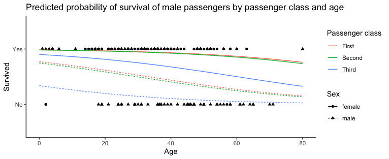

# TITANIC

This project includes a collection of data relating to the titanic event.

## Data set includes :

-   The number of passengers survived
-   The proportion of passenger that survived and did not survived
-   The distribution of passenger class
-   The proportion of survived passenger by class
-   The relationship between two variables
-   The distribution of age of passenger
-   Comparison on the survival rate between male and female

### Predicted probability of survival of male passengers class and age

\-\-\-\-\-\-\-\-\-\-\-\-\-\-\-\-\-\-\-\-\-\-\-\-\-\-\-\-\-\-\-\-\-\-\-\-\-\-\-\-\-\-\-\-\-\-\-\-\-\-\-\-\-\-\-\-\-\-\-\-\-\-\-\-\-\-\-\-\-\-\-\-\-\-\-\-\--

Thank you for checking out my first individual Git project! 😄
